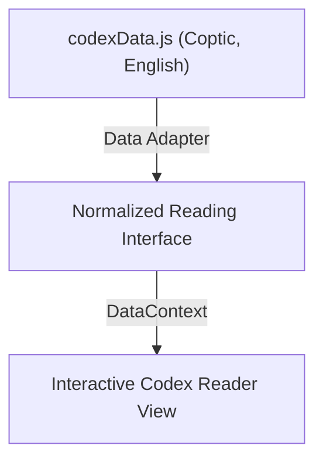

# 낙함마디(Nag Hammadi) 데이터 이식 프로젝트 정밀 분석 보고서

---

## 1. 개요 및 프로젝트 이식 상태

본 프로젝트 `nag-1`은 기존의 React 19 + Vite 기반 `3body`(인위삼신행상명등론) 학습 리더 애플리케이션의 골격을 복제한 구조
여기에 낙함마디 문서 데이터인 `codexData.js`와 `codexIndex.js`를 주입했으나 핵심 구동부와의 정합이 이루어지지 않아 정상 동작이 불가능한 불완전 이식 상태임

---

## 2. 디렉토리 구성 및 리소스 혼재 실태

### 2.1 이식된 신규 데이터 자산
*   `src/data/codexData.js` (1.9MB): 낙함마디 코덱스 I ~ XIII의 Coptic 원문과 English 번역 텍스트를 포함하는 원천 데이터
*   `src/data/codexIndex.js` (18KB): 낙함마디 문헌의 계층 트리 구조(Codex -> Work -> Section)를 명시한 인덱스 데이터
*   이 두 파일은 현재 프로젝트 루트와 `src/data/` 양쪽에 중복 배포되어 있으며 실제 런타임 코드에서는 참조되지 않는 데드 소스 상태임

### 2.2 이전 프로젝트(3body)의 데이터 잔재
*   `public/reading-snapshot.json`: 인위삼신행상명등론의 티베트어, 발음, 한국어, 영어 번역 데이터를 담은 JSON 파일로 현재 `dataFetcher.ts`가 강제 로딩 중
*   `public/reading-data.json`: 3body용 계층 구조 데이터로 `App.tsx`의 헤더 아코디언 메뉴 구성에 사용됨
*   `data.js` (루트, 265KB): 요가수트라(Yoga Sutras)의 범어 원문 및 해설 데이터로 현 시점에서는 아무런 가치가 없는 쓰레기 파일

### 2.3 스크립트 파이프라인의 명세 괴리
*   `scripts/README.md`는 낙함마디 데이터 가공 및 병합을 위한 PowerShell 스크립트(`generate_data.ps1`, `merge_tokens.ps1`)를 기술함
*   그러나 실제 `scripts/` 폴더 내부에는 해당 스크립트들이 누락되어 있고 이전 3body용 ODT 파서와 무관한 Playwright 스모크 테스트 스크립트만 잔존함

---

## 3. 런타임 동작 메커니즘 분석 및 단절 영역

### 3.1 컴파일 타임 오류 (Typecheck 실패)
*   `src/utils/dataFetcher.ts`에서 존재하지 않는 3body용 주석 모듈(`chapter1Commentary.ts` 등 4개 파일)을 무조건 임포트하도록 하드코딩됨
*   이로 인해 `npm run typecheck` 실행 시 모듈 부재 에러와 암묵적 `any` 타입 오류를 발생시키며 빌드가 원천 차단됨

### 3.2 데이터 스키마의 불합치 (Data Shape Mismatch)
*   애플리케이션의 핵심 컴포넌트(`VerseView.tsx` 등)와 컨텍스트(`YogaDataContext.tsx`)는 아래와 같은 3body 스키마를 기대함:
    *   `sanskrit` (티베트어 원문)
    *   `iast` / `pronunciation` (발음 및 표기)
    *   `translation_ham` (한국어 번역)
    *   `commentary_ko` (한국어 주석)
*   반면 주입된 낙함마디 문헌 데이터(`codexData.js`)는 아래와 같은 전혀 다른 스펙을 지님:
    *   `coptic` (콥트어 원천 문자)
    *   `english` (영어 번역)
    *   `range` (코덱스 내의 page 및 line 구조)
*   이 두 스키마를 중재할 데이터 어댑터 혹은 파싱 유틸리티가 부재하여 UI 렌더링 카드와 데이터가 매핑될 수 없음

---

## 4. 발견된 세부 문제점 목록 및 위험 요인

1.  **TypeScript 컴파일 및 빌드 불가**
    *   주석 데이터 파일의 부재 및 타입 바인딩 규격 불일치로 프로덕션 빌드가 원천적으로 깨진 상태
2.  **런타임 데이터 흐름의 차단**
    *   `codexData.js`와 `codexIndex.js`가 주입만 되었을 뿐 프론트엔드 라우터 및 데이터 페처와 통신하지 않음
    *   여전히 이전 삼신행상명등론의 로컬 데이터 패스를 페칭하고 있어 화면에 콥트어 문서가 아닌 불교 문헌이 표시되는 정체성 혼란 노출
3.  **검증 테스트 도구의 비활성화**
    *   `browser_smoke.mjs`를 포함한 Playwright E2E 테스트가 이전 3body 라우트 규칙에 종속되어 있어 테스트 자체가 전면 붕괴됨
4.  **레거시 리소스 누적 및 스크립트 불일치**
    *   PowerShell 기반의 데이터 재생성 도구는 실제 존재하지 않고 3body용 유물들만 자리 잡아 유지보수 복잡도 가중

---

## 5. Meta-Design 관점의 아키텍처 개선 로드맵

Awwwards 및 CSS Design Awards 수준의 완성도와 확장성을 확보하기 위한 정비 방향성

1.  **데이터 어댑터 패턴 (Data Adapter Pattern) 적용**
    *   낙함마디 문헌의 `coptic`을 `sanskrit` 속성에, `english`를 번역 속성에 기계적으로 맵핑할 변환 레이어 구축
    *   이를 통해 컴포넌트의 대폭적인 수정 없이 런타임 데이터 교체 가능
2.  **도메인 용어 및 타입 스키마 리팩토링**
    *   `YogaSutra` 및 `YogaChapter` 등의 도메인 종속적 타입들을 `CodexSection`, `CodexWork` 등 낙함마디 문헌 체계에 맞는 시맨틱한 네이밍으로 전환
3.  **Node.js 기반의 데이터 추출 단일 파이프라인 복원**
    *   PowerShell에 의존하지 않고 Node.js 단독으로 Coptic 데이터 가공 및 토큰 매핑을 보장할 수 있는 안정적 데이터 가공 스크립트 작성
4.  **UI 레이아웃 및 다크 모드 렌더링 최적화**
    *   Coptic 폰트(Noto Sans Coptic) 및 양가죽 Parchment 테마가 낙함마디 문서의 고대 아우라를 극대화할 수 있도록 CSS 변수 및 서체 로딩 구조 정비
