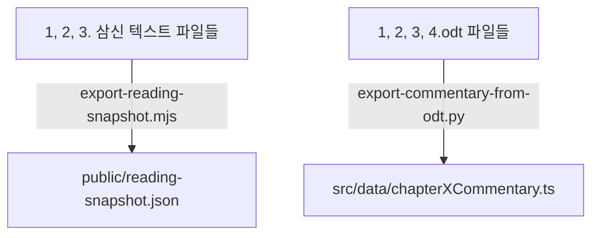
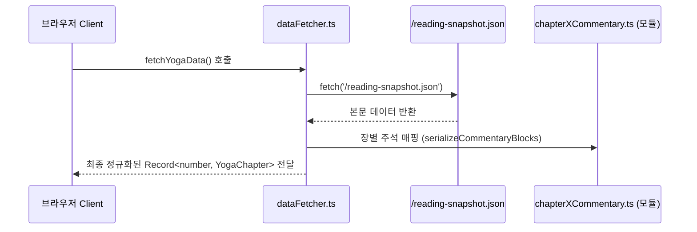

# 인위삼신행상명등론 프로젝트 저장소 분석 보고서

본 보고서는 요가수트라(Yoga Sutras) 애플리케이션 뼈대를 기반으로 이식된 "인위삼신행상명등론(因位三身行相明燈論)" 독서 및 학습 애플리케이션 저장소의 전체 아키텍처, 데이터 파이프라인, UI 컴포넌트, 스크립트 도구 및 상태 관리 구조를 상세히 기술합니다.

---

## 1. 개요 및 저장소 정체성
본 프로젝트는 기존 요가수트라 앱의 고급스러운 UI 레이아웃(Parchment 질감, Gold 테두리, 다크 모드)과 컴포넌트 아키텍처를 재사용하되, 데이터 소스를 **인위삼신행상명등론**의 텍스트와 학습만화, 해설 데이터로 완전히 대체한 React 19 + Vite 기반의 싱글 페이지 애플리케이션(SPA)입니다.

---

## 2. 디렉토리 구조 및 주요 파일 인벤토리

### 2.1 루트 디렉토리 소스 파일
*   **텍스트 소스**: `1. 삼신 티벳-한글.txt`, `2. 삼신 영어.txt`, `3. 삼신 목차.txt` (티벳어 원문, 다국어 번역 및 목차 범위 정보 제공)
*   **주석 소스**: `1.odt`, `2.odt`, `3.odt`, `4.odt` (장별 상세 해설 및 구조화된 테이블 데이터를 담은 OpenDocument 텍스트 파일)
*   **설정 파일**: `vite.config.ts` (React 및 Tailwind 4 플러그인 설정), `tsconfig.json` (타입스크립트 컴파일 사양)

### 2.2 `src/` 디렉토리 아키텍처
*   `src/App.tsx`: 애플리케이션 진입점 및 라우팅 설정, `ContextAccordionPicker` 및 전체 `MainLayout` 정의.
*   `src/index.css`: Tailwind 4 기반 테마 및 변수(폰트, 컬러 팰릿, 모션 곡선 등) 정의 및 글로벌 스타일 시트.
*   `src/types.ts`: `YogaSutra`, `YogaChapter`, `CommentaryBlock` 등 핵심 데이터 모델의 TypeScript 인터페이스 정의.
*   `src/context/`:
    *   `YogaDataContext.tsx`: 원격에서 가져온 구절 데이터를 주입하고 검색 유틸을 제공하는 전역 컨텍스트 프로바이더.
    *   `UIContext.tsx`: 사이드바 토글 및 심화/해설 뷰 모드 상태 관리.
    *   `ThemeContext.tsx`: 라이트/다크 테마 모드 제어 및 로컬 스토리지 동기화.
*   `src/hooks/`:
    *   `useYogaData.ts`: `YogaDataContext` 편의용 훅.
    *   `useAudio.ts`: 오디오 플레이어의 상태(재생 여부, 진행률, 버퍼 시간 등) 및 제어 논리 훅.
    *   `useSutraNavigation.ts`: 이전/다음 구절 이동을 계산하는 유틸리티 훅.
*   `src/components/`:
    *   `Header.tsx` / `Sidebar.tsx`: 앱 레이아웃 상하단/좌측 영역 구성원.
    *   `verse/`: 본문 카드 내 `SutraContent` (티벳어 텍스트), `WordMeanings` (단어 사전), `AudioPlayer` (오디오 제어 바), `TranslationSection` (다양한 한국어/영어 번역) 렌더링 담당.
    *   `commentary/`: `CommentaryMarkdown.tsx`를 통해 해설 텍스트 내 Markdown 요소(제목, 목록, 테이블 등)를 파싱하여 출력.
*   `src/pages/`:
    *   `VerseView.tsx`: 개별 구절의 텍스트, 번역 및 해설/학습만화 패널을 유기적으로 엮어주는 메인 뷰 페이지.

### 2.3 `scripts/` 디렉토리 빌드 및 검증 도구
*   `export-reading-snapshot.mjs`: 루트의 삼신 텍스트 파일(1, 2, 3번)들을 파싱하여 `public/reading-snapshot.json`으로 추출하는 파이프라인.
*   `export-commentary-from-odt.py`: Python 라이브러리를 사용해 `1.odt`~`4.odt` XML에서 마크다운 형태의 주석 구조를 추출, `src/data/chapterXCommentary.ts` 모듈 파일들을 생성.
*   `browser_smoke.mjs`: Playwright 기반 E2E 테스트 스크립트.

---

## 3. 데이터 흐름 및 빌드 파이프라인

### 3.1 빌드 타임 데이터 정규화 및 파이프라인
프로젝트의 데이터는 아래와 같은 빌드타임 도구 체인을 거쳐 가공됩니다.

1.  **본문 텍스트 생성**: `scripts/export-reading-snapshot.mjs`가 `src/lib/parseThreeBodiesCore.js`를 모듈로 불러와 귀의의 찬시(문단 1)를 제1장에 병합하고 전체 문단을 4개 장 구조로 재배치한 뒤 `public/reading-snapshot.json`으로 빌드합니다.
2.  **해설 텍스트 생성**: `scripts/export-commentary-from-odt.py`가 ODT 압축 패키지 내 `content.xml`을 파싱하여 본문 문장, 목록(`list`), 테이블(`table`) 요소를 정밀 추출해 TypeScript 모듈로 직접 소스 빌드합니다.

### 3.2 런타임 데이터 흐름 및 매핑
애플리케이션 구동 및 구절 로딩은 아래와 같이 유기적으로 진행됩니다.

1.  **데이터 초기 로딩**: `YogaDataProvider` 마운트 시 `fetchYogaData()`가 실행되어 `/reading-snapshot.json`을 단 한 번만 fetch하여 로컬 캐시에 저장합니다.
2.  **주석 결합**: 각 문단을 파싱할 때 `dataFetcher.ts` 내 `getCommentaryBlocks`가 해당 문단 ID 또는 인덱스를 키로 삼아 `chapterXCommentary` 모듈에 내장된 원시 데이터를 찾습니다. 이후 `serializeCommentaryBlocks`를 호출하여 원시 목록/테이블/문단 배열을 완성도 높은 마크다운 문자열(`commentary_en`)로 직렬화하여 본문 데이터와 병합합니다.
3.  **UI 바인딩**: 최종 구성된 `YogaChapter` 및 `YogaSutra` 컬렉션은 `YogaDataContext`를 통해 하위 컴포넌트(본문 카드, 해설 탭)로 분배됩니다.

---

## 4. UI 아키텍처 및 라우팅 분석

### 4.1 라우팅 사양
`src/App.tsx`에서 `BrowserRouter`를 통해 클라이언트 사이드 라우팅을 수행합니다.
*   **`/`**: 진입 시 `DefaultVerseRedirect` 컴포넌트가 활성화되어 `chapters[0]`의 첫 번째 구절 정보를 읽어 `/chapter/1/verse/1`로 자동 리다이렉트(replace) 처리합니다.
*   **`/chapter/:chapterNum/verse/:verseNum`**: 지정된 장/절 파라미터를 읽어 `VerseView` 페이지를 동적 렌더링합니다.

### 4.2 메인 레이아웃 및 쉘 구조
`MainLayout` 컴포넌트가 전체의 토대가 되며, 화면 크기와 뷰 모드에 따라 격자구조를 다이내믹하게 변경합니다.
*   **AppShell**: 사이드바 개폐 및 테마 상태를 통합 관리하는 최상단 프레임워크입니다.
*   **Header**: 제목(`인위삼신행상명등론`) 및 구절 선택 아코디언 컴포넌트(`ContextAccordionPicker`)가 마운트됩니다.
*   **Sidebar**: 현재 절의 요약 번역 텍스트와 기하학적 메타 데이터 휠(Axis) 애니메이션을 표시합니다.

### 4.3 장/절 선택 컴포넌트 (`ContextAccordionPicker` & `OutlineTree`)
헤더에서 아코디언 형태로 펼쳐지는 메뉴로, 계층적인 책의 장/절을 이동할 수 있습니다.
*   **아웃라인 소스**: `public/reading-data.json`에서 삼신 4개 장 계층 트리 구조를 파싱하여 활용합니다.
*   **그룹 탭 숨김 로직**: 본 프로젝트는 책이 단 1권(`인위삼신행상명등론`)이므로 아웃라인 내 그룹 개수가 1개 이하일 경우 불필요한 대분류 탭 버튼이 표시되지 않도록 렌더링을 차단합니다.
*   **중복 제거 필터**: 트리 노드 및 절 선택 영역 하단 카드에서 반복 표시되던 중복 칩과 중복 장 제목 라벨 등을 걷어내어 극도의 직관성을 확보하였습니다.

### 4.4 구절 본문 및 해설 뷰 (`VerseView`)
*   **VERSE 뷰 (본문)**: 산스크리트어(티벳어 원문), 단어 사전 사전식 나열(`WordMeanings`), 오디오 제어 도구 및 다양한 번역본(Ham/Gil/Jimong/Suk 등)의 번역 비교 패널을 일목요연하게 카드 레이아웃으로 출력합니다.
*   **COMMENTARY 뷰 (해설/만화)**: `UIContext`에서 모드가 `commentary`로 변경되면 우측에 마운트되며, 학습 만화 이미지(`learningComicImages` glob 매핑) 또는 ODT에서 빌드된 마크다운 주석 텍스트를 토글하여 감상할 수 있습니다.

---

## 5. 전역 상태 관리 및 컨텍스트

1.  **`ThemeContext`**: 다크 모드 활성화 여부를 HTML 클래스(`dark`) 조작을 통해 전체 컴포넌트에 전파하며, 테마 변경 이력을 로컬 스토리지에 영구 저장합니다.
2.  **`UIContext`**: 데스크톱/모바일 사이드바 활성화 제어와 본문(`body`) 및 해설(`commentary`) 토글 상태를 공유합니다.
3.  **`YogaDataContext`**: 데이터 fetch 과정의 오류 핸들링 및 전역 로딩 스피너 제어, 임의 구절 이동 범위 계산 등을 도맡아 수행합니다.

---

## 6. 기술 부채 및 아키텍처 개선 제안

1.  **요가수트라 레거시 파일 정리**:
    *   `src/constants.ts`의 `YOGA_CHAPTERS_META` 및 `scripts/generate_data.ps1`, `update_dictionary.ps1` 등은 현재 삼신 프로젝트에서 사용되지 않는 요가수트라 전용 레거시 스크립트이므로 혼선 방지를 위해 점진적 정리가 권장됩니다.
2.  **테마 색상 정비**:
    *   `src/index.css`에 정의된 HSL 및 Hex 코드에 일부 요가수트라 톤이 섞여 있으므로, 삼신 프로젝트의 고유한 티벳 융단 및 사원 느낌의 양식에 맞춘 컬러 팔레트 다듬기 작업을 지속적으로 지원할 필요가 있습니다.
3.  **오디오 파일 오차 매핑 검증**:
    *   `scripts/check_audio_mismatch.cjs`를 구동하여 실제 에셋 폴더 내 mp3와 `reading-snapshot.json`의 오디오 바인딩 간 어긋남이 없는지 최종 릴리즈 전 체크 단계가 유용합니다.
